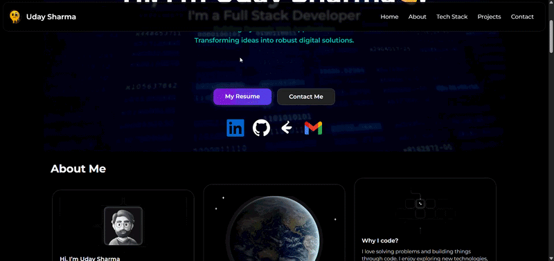

<div align="center">


<h1>👋 Hi, I'm Uday Sharma</h1>

<h3>Software Engineer • Full Stack Developer • DevOps • AI Enthusiast</h3>

<p>
Passionate about building scalable applications, cloud-native solutions, and modern user experiences.
</p>


<br><br>

<a href="https://udaysharma.me">

</a>

<a href="https://www.linkedin.com/in/udysharma">

</a>

<a href="https://github.com/Udysharma">

</a>

</div>

---

# 🌐 Live Portfolio

## 🚀 https://udaysharma.me

Explore my portfolio to discover my projects, certifications, technical skills, and development journey.

---

# 🖥️ Portfolio Preview

> Replace `preview.gif` with a GIF or screenshot of your own portfolio.

<p align="center">



</p>

---

# 🚀 About Me


I'm a **Computer Science undergraduate** passionate about creating scalable software solutions and modern web applications.

### Areas of Interest

- 🌐 Full Stack Development
- ☕ Spring Boot
- ⚛️ React
- ☁️ AWS Cloud
- ⚙️ DevOps
- 🤖 Machine Learning
- 🔐 Cyber Security

---

# 🛠 Tech Stack

<p align="center">


</p>

---

# ✨ Features

- 🎨 Modern UI
- 📱 Responsive Design
- ⚡ Fast Performance
- 🌙 Smooth Animations
- 💼 Project Showcase
- 📜 Certifications
- 📄 Resume Download
- 📬 Contact Form
- 🔍 SEO Optimized

---

# 📂 Project Structure

```text
src/
├── assets/
├── components/
├── pages/
├── hooks/
├── App.jsx
└── main.jsx
```

---

# 🚀 Getting Started

Clone the repository

```bash
git clone https://github.com/Udysharma/portfolio-new.git
```

Navigate into the project

```bash
cd portfolio-new
```

Install dependencies

```bash
npm install
```

Run locally

```bash
npm run dev
```

Build production version

```bash
npm run build
```

---

# ⚙️ Development Workflow

<p align="center">


</p>

---

# 📚 Currently Learning

```text
███████████████████████████  Spring Boot

████████████████████████░░░  AWS

███████████████████████░░░░  Docker

██████████████████████░░░░░  Kubernetes

████████████████████████░░░  DevOps

█████████████████████████░░  Machine Learning
```

---

# 🌍 Connect With Me

<p align="center">

<a href="https://udaysharma.me">

</a>

<a href="https://www.linkedin.com/in/udysharma">

</a>

<a href="https://github.com/Udysharma">

</a>

</p>

<p align="center">

📧 **udaysharma6x@gmail.com**

</p>

---

<div align="center">


## ⭐ Thanks for visiting!

If you like this project, consider giving it a **Star ⭐**

</div>


